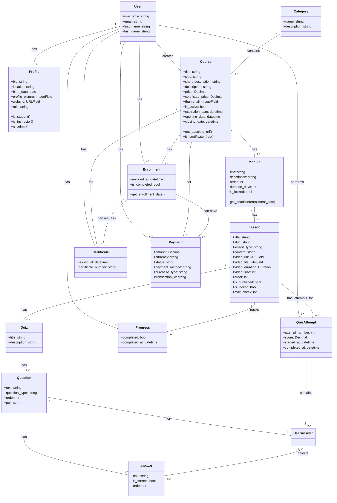

```mermaid
classDiagram
    class User {
        +username: string
        +email: string
        +first_name: string
        +last_name: string
    }

    class Profile {
        +bio: string
        +location: string
        +birth_date: date
        +profile_picture: ImageField
        +website: URLField
        +role: string
        +is_student()
        +is_instructor()
        +is_admin()
    }

    class Category {
        +name: string
        +description: string
    }

    class Course {
        +title: string
        +slug: string
        +short_description: string
        +description: string
        +price: Decimal
        +certificate_price: Decimal
        +thumbnail: ImageField
        +is_active: bool
        +expiration_date: datetime
        +opening_date: datetime
        +closing_date: datetime
        +get_absolute_url()
        +is_certificate_free()
    }

    class Module {
        +title: string
        +description: string
        +order: int
        +duration_days: int
        +is_locked: bool
        +get_deadline(enrollment_date)
    }

    class Lesson {
        +title: string
        +slug: string
        +lesson_type: string
        +content: string
        +video_url: URLField
        +video_file: FileField
        +video_duration: Duration
        +video_size: int
        +order: int
        +is_published: bool
        +is_locked: bool
        +max_check: int
    }

    class Quiz {
        +title: string
        +description: string
    }

    class Question {
        +text: string
        +question_type: string
        +order: int
        +points: int
    }

    class Answer {
        +text: string
        +is_correct: bool
        +order: int
    }

    class Enrollment {
        +enrolled_at: datetime
        +is_completed: bool
        +get_enrollment_date()
    }

    class Progress {
        +completed: bool
        +completed_at: datetime
    }

    class Certificate {
        +issued_at: datetime
        +certificate_number: string
    }

    class Payment {
        +amount: Decimal
        +currency: string
        +status: string
        +payment_method: string
        +purchase_type: string
        +transaction_id: string
    }
    
    class QuizAttempt {
        +attempt_number: int
        +score: Decimal
        +started_at: datetime
        +completed_at: datetime
    }

    class UserAnswer {
    }

    User "1" -- "1" Profile : has
    User "1" -- "0..*" Course : created
    User "1" -- "0..*" Enrollment : has
    User "1" -- "0..*" Progress : has
    User "1" -- "0..*" Certificate : has
    User "1" -- "0..*" Payment : has
    User "1" -- "0..*" QuizAttempt : performs

    Category "1" -- "0..*" Course : contains
    Course "1" -- "0..*" Module : has
    Course "1" -- "0..*" Enrollment : has
    Course "1" -- "0..*" Certificate : for
    Course "1" -- "0..*" Payment : for

    Module "1" -- "0..*" Lesson : has

    Lesson "1" -- "0..1" Quiz : has
    Lesson "1" -- "0..*" Progress : tracks
    Lesson "1" -- "0..*" QuizAttempt : has_attempts_for

    Quiz "1" -- "0..*" Question : has

    Question "1" -- "0..*" Answer : has
    Question "1" -- "0..*" UserAnswer : for

    Enrollment "1" -- "1" Certificate : can result in
    Enrollment "1" -- "0..*" Payment : can have

    QuizAttempt "1" -- "0..*" UserAnswer : contains
    UserAnswer "0..*" -- "0..*" Answer : selects
```