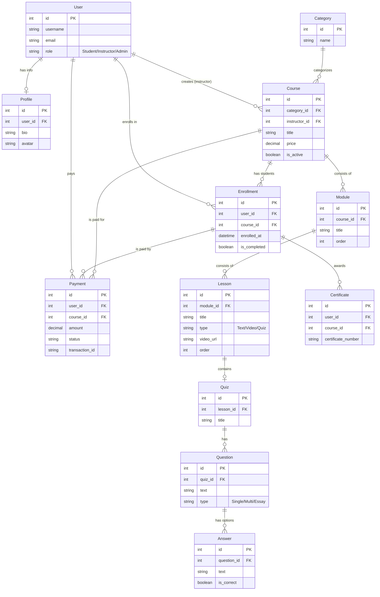

## Database Diagram (DD)

> **Note:** This is a simple DD template, not the original structure

```mermaid
erDiagram
    %% User Management
    User ||--o| Profile : "has info"
    User ||--o{ Course : "creates (instructor)"
    User ||--o{ Enrollment : "enrolls in"
    User ||--o{ Payment : "pays"

    %% Course Structure
    Category ||--o{ Course : "categorizes"
    Course ||--o{ Module : "consists of"
    Module ||--o{ Lesson : "consists of"
    
    %% Quiz Structure
    Lesson ||--o| Quiz : "contains"
    Quiz ||--o{ Question : "has"
    Question ||--o{ Answer : "has options"

    %% Business Logic
    Course ||--o{ Enrollment : "has students"
    Enrollment ||--o{ Payment : "is paid by"
    Course ||--o{ Payment : "is paid for"
    Enrollment ||--o{ Certificate : "awards"

    User {
        int id PK
        string username
        string email
        string role "Student/Instructor/Admin"
    }

    Profile {
        int id PK
        int user_id FK
        string bio
        string avatar
    }

    Category {
        int id PK
        string name
    }

    Course {
        int id PK
        int category_id FK
        int instructor_id FK
        string title
        decimal price
        boolean is_active
    }

    Module {
        int id PK
        int course_id FK
        string title
        int order
    }

    Lesson {
        int id PK
        int module_id FK
        string title
        string type "Text/Video/Quiz"
        string video_url
        int order
    }

    Quiz {
        int id PK
        int lesson_id FK
        string title
    }

    Question {
        int id PK
        int quiz_id FK
        string text
        string type "Single/Multi/Essay"
    }

    Answer {
        int id PK
        int question_id FK
        string text
        boolean is_correct
    }

    Enrollment {
        int id PK
        int user_id FK
        int course_id FK
        datetime enrolled_at
        boolean is_completed
    }

    Certificate {
        int id PK
        int user_id FK
        int course_id FK
        string certificate_number
    }

    Payment {
        int id PK
        int user_id FK
        int course_id FK
        decimal amount
        string status
        string transaction_id
    }
```
