# Block Flow Diagram - LearnOnline Website

## Overview
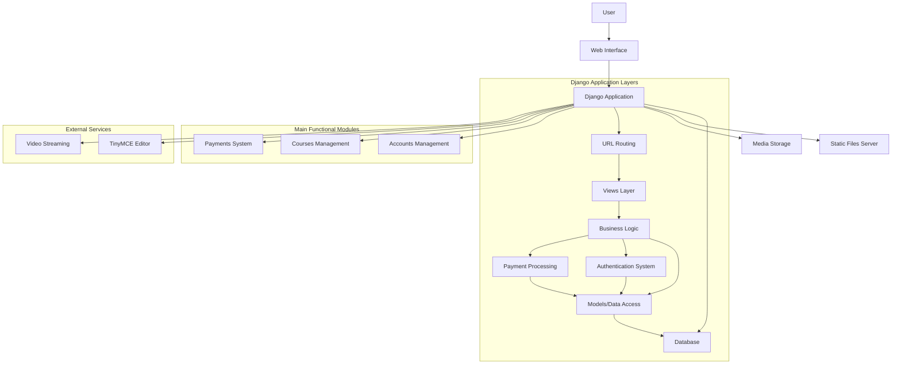

## Detailed Components

### 1. User Interface Layer
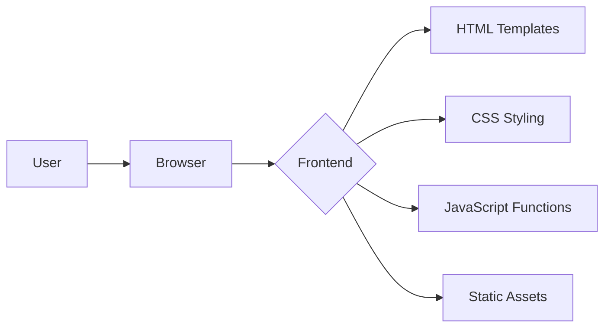

### 2. Authentication & Authorization System
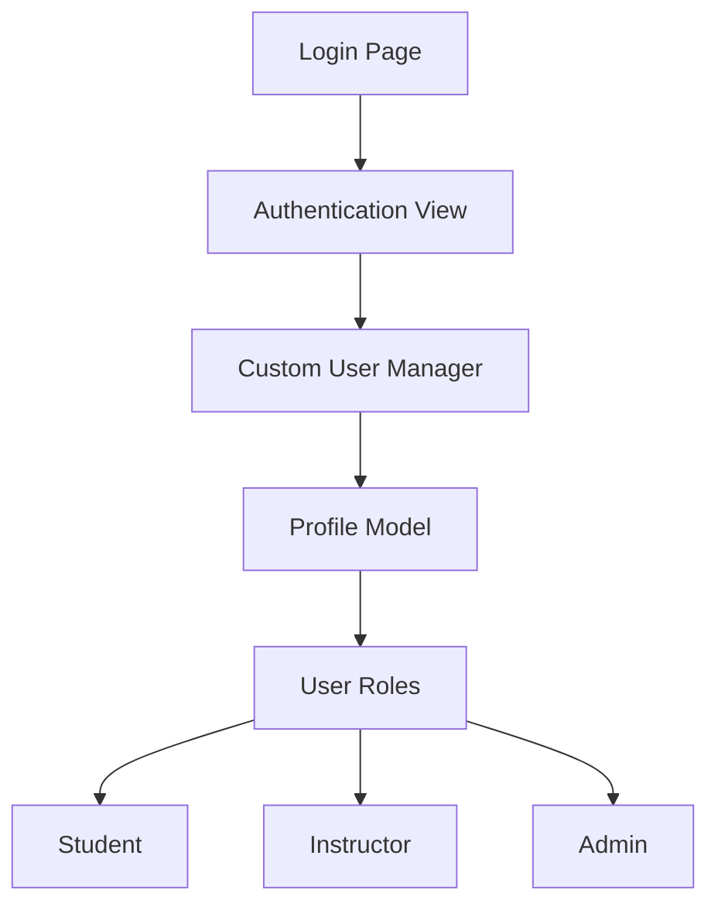

### 3. Course Management System
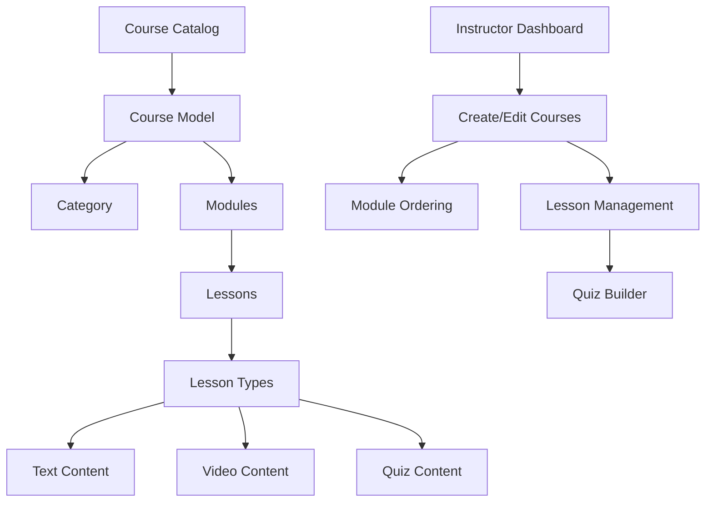

### 4. Learning Process
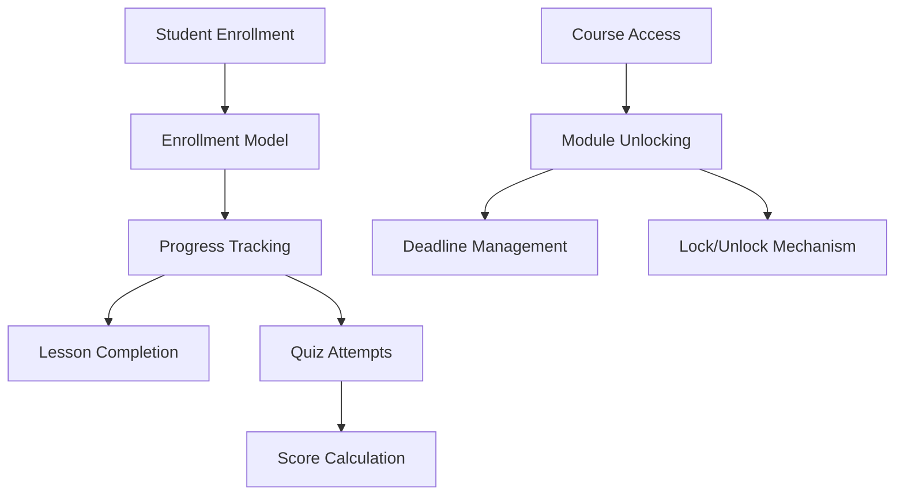

### 5. Payment System
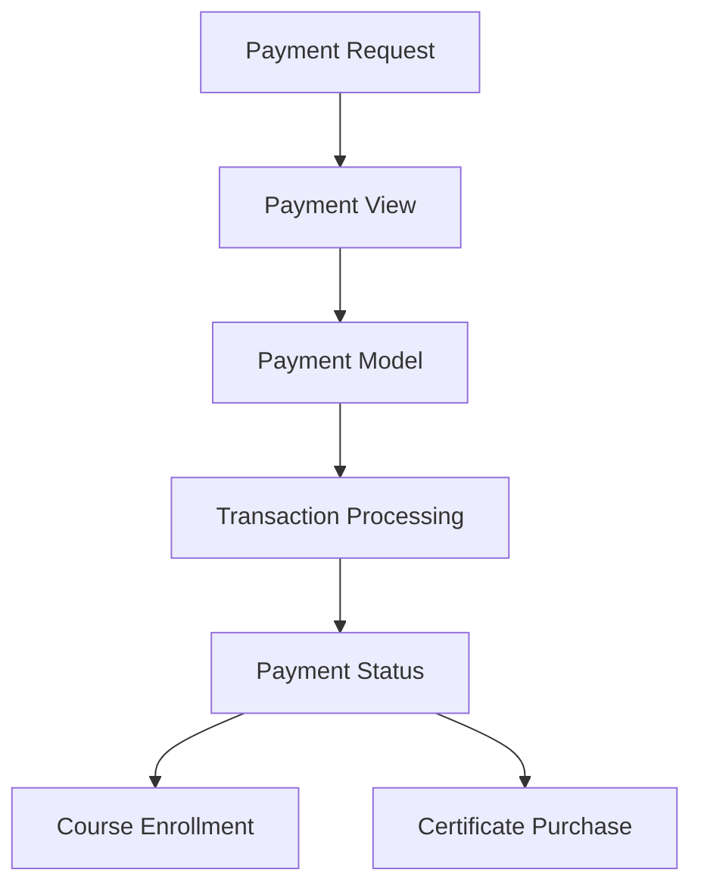

### 6. Certificate System
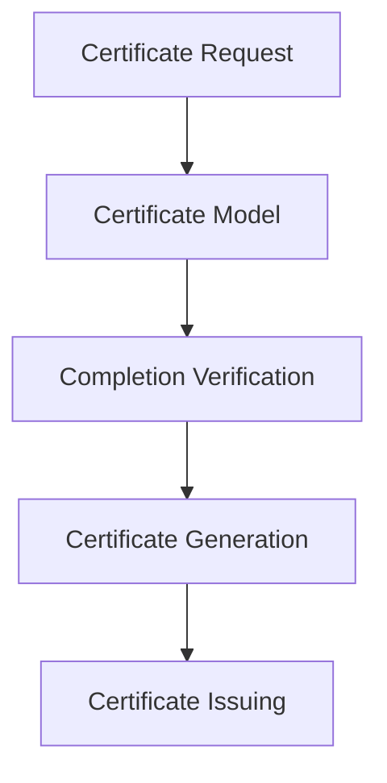

## Data Flow

### User Registration Flow
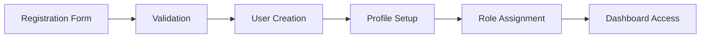

### Course Enrollment Flow
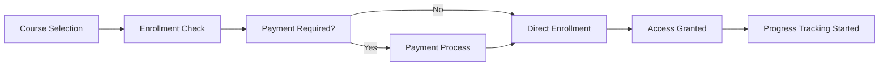

### Learning Process Flow
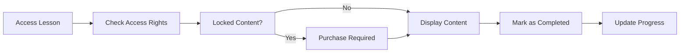

### Quiz Taking Flow
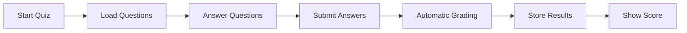

## Key Relationships

### Core Entity Relationships
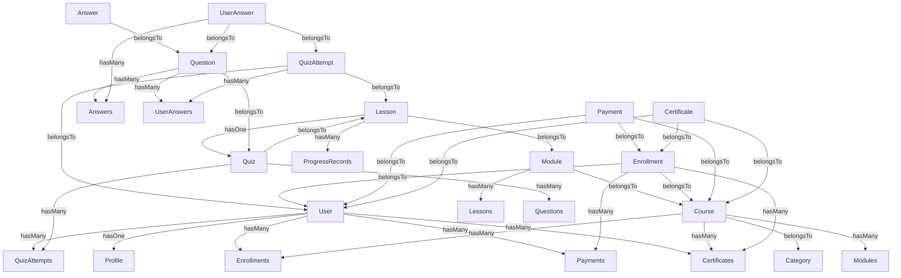

## System Architecture
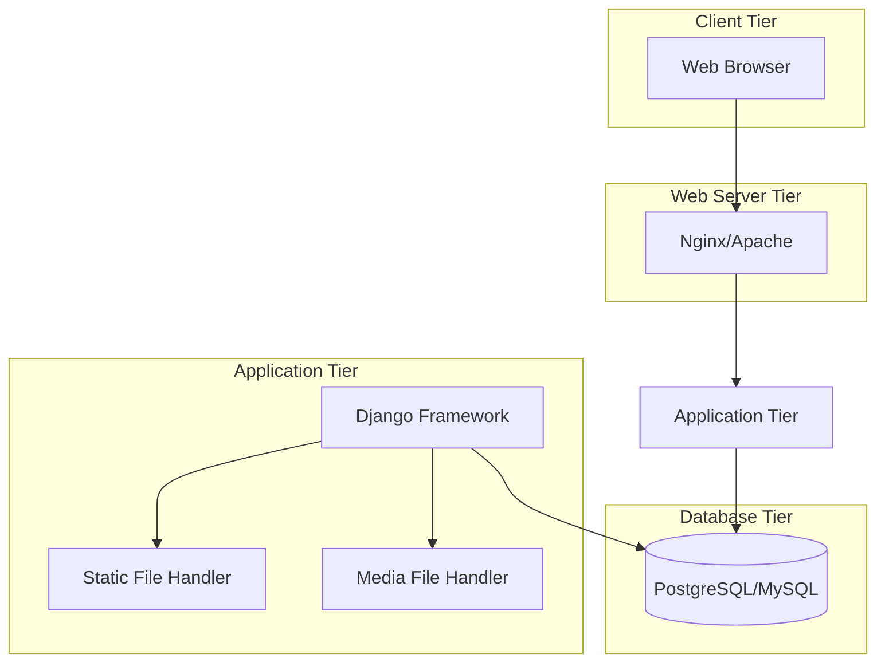