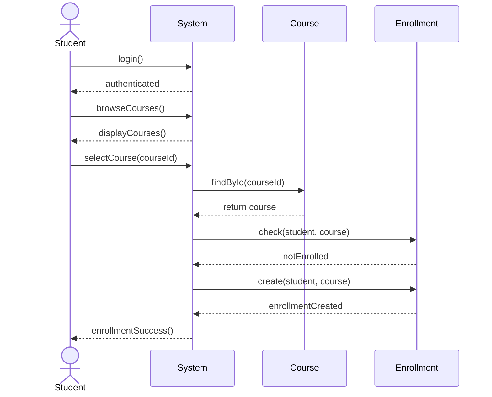
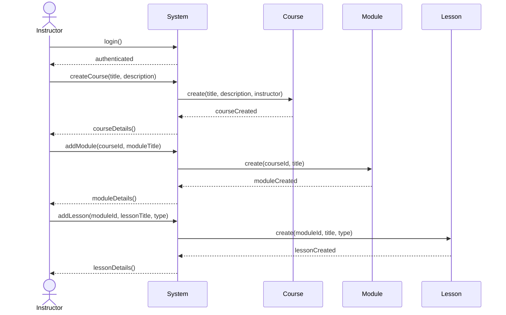
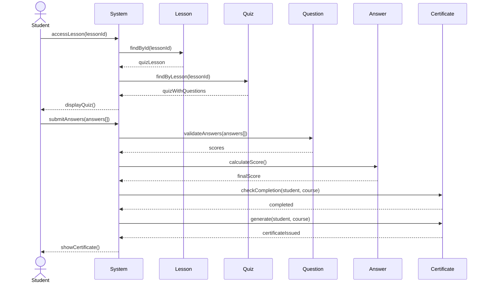

## Sequence Diagrams

### Student Enrolls in Course

```mermaid
sequenceDiagram
    actor Student
    participant System
    participant Course
    participant Enrollment

    Student->>System: login()
    System-->>Student: authenticated
    Student->>System: browseCourses()
    System-->>Student: displayCourses()
    Student->>System: selectCourse(courseId)
    System->>Course: findById(courseId)
    Course-->>System: return course
    System->>Enrollment: check(student, course)
    Enrollment-->>System: notEnrolled
    System->>Enrollment: create(student, course)
    Enrollment-->>System: enrollmentCreated
    System-->>Student: enrollmentSuccess()
```

### Instructor Creates Course with Modules and Lessons

```mermaid
sequenceDiagram
    actor Instructor
    participant System
    participant Course
    participant Module
    participant Lesson

    Instructor->>System: login()
    System-->>Instructor: authenticated
    Instructor->>System: createCourse(title, description)
    System->>Course: create(title, description, instructor)
    Course-->>System: courseCreated
    System-->>Instructor: courseDetails()

    Instructor->>System: addModule(courseId, moduleTitle)
    System->>Module: create(courseId, title)
    Module-->>System: moduleCreated
    System-->>Instructor: moduleDetails()

    Instructor->>System: addLesson(moduleId, lessonTitle, type)
    System->>Lesson: create(moduleId, title, type)
    Lesson-->>System: lessonCreated
    System-->>Instructor: lessonDetails()
```

### Student Takes Quiz and Gets Certificate

```mermaid
sequenceDiagram
    actor Student
    participant System
    participant Lesson
    participant Quiz
    participant Question
    participant Answer
    participant Certificate

    Student->>System: accessLesson(lessonId)
    System->>Lesson: findById(lessonId)
    Lesson-->>System: quizLesson
    System->>Quiz: findByLesson(lessonId)
    Quiz-->>System: quizWithQuestions
    System-->>Student: displayQuiz()

    Student->>System: submitAnswers(answers[])
    System->>Question: validateAnswers(answers[])
    Question-->>System: scores
    System->>Answer: calculateScore()
    Answer-->>System: finalScore

    System->>Certificate: checkCompletion(student, course)
    Certificate-->>System: completed
    System->>Certificate: generate(student, course)
    Certificate-->>System: certificateIssued
    System-->>Student: showCertificate()
```