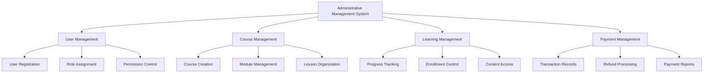
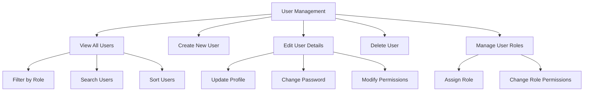
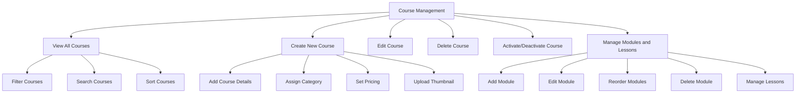
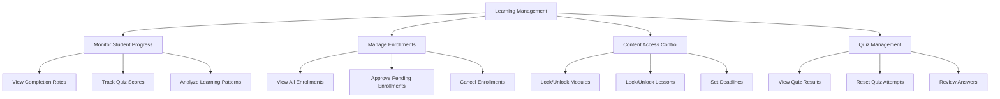
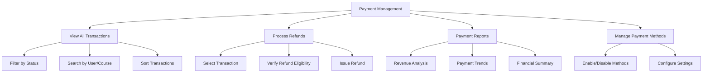
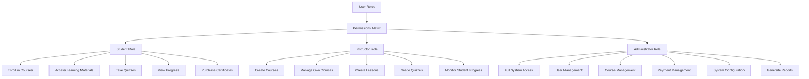

# Administrative Management System - LearnOnline

## Overview

```mermaid
graph TB
    A[Administrative Management System] --> B[User Management]
    A --> C[Course Management]
    A --> D[Learning Management]
    A --> E[Payment Management]
    
    B --> B1[User Registration]
    B --> B2[Role Assignment]
    B --> B3[Permission Control]
    
    C --> C1[Course Creation]
    C --> C2[Module Management]
    C --> C3[Lesson Organization]
    
    D --> D1[Progress Tracking]
    D --> D2[Enrollment Control]
    D --> D3[Content Access]
    
    E --> E1[Transaction Records]
    E --> E2[Refund Processing]
    E --> E3[Payment Reports]
```

## User Management

```mermaid
graph TD
    A[User Management] --> B[View All Users]
    A --> C[Create New User]
    A --> D[Edit User Details]
    A --> E[Delete User]
    A --> F[Manage User Roles]
    
    F --> G[Assign Role]
    F --> H[Change Role Permissions]
    
    B --> I[Filter by Role]
    B --> J[Search Users]
    B --> K[Sort Users]
    
    D --> L[Update Profile]
    D --> M[Change Password]
    D --> N[Modify Permissions]
```

## Course Management

```mermaid
graph TD
    A[Course Management] --> B[View All Courses]
    A --> C[Create New Course]
    A --> D[Edit Course]
    A --> E[Delete Course]
    A --> F[Activate/Deactivate Course]
    A --> G[Manage Modules and Lessons]
    
    B --> H[Filter Courses]
    B --> I[Search Courses]
    B --> J[Sort Courses]
    
    C --> K[Add Course Details]
    C --> L[Assign Category]
    C --> M[Set Pricing]
    C --> N[Upload Thumbnail]
    
    G --> O[Add Module]
    G --> P[Edit Module]
    G --> Q[Reorder Modules]
    G --> R[Delete Module]
    G --> S[Manage Lessons]
```

## Learning Management

```mermaid
graph TD
    A[Learning Management] --> B[Monitor Student Progress]
    A --> C[Manage Enrollments]
    A --> D[Content Access Control]
    A --> E[Quiz Management]
    
    B --> F[View Completion Rates]
    B --> G[Track Quiz Scores]
    B --> H[Analyze Learning Patterns]
    
    C --> I[View All Enrollments]
    C --> J[Approve Pending Enrollments]
    C --> K[Cancel Enrollments]
    
    D --> L[Lock/Unlock Modules]
    D --> M[Lock/Unlock Lessons]
    D --> N[Set Deadlines]
    
    E --> O[View Quiz Results]
    E --> P[Reset Quiz Attempts]
    E --> Q[Review Answers]
```

## Payment Management

```mermaid
graph TD
    A[Payment Management] --> B[View All Transactions]
    A --> C[Process Refunds]
    A --> D[Payment Reports]
    A --> E[Manage Payment Methods]
    
    B --> F[Filter by Status]
    B --> G[Search by User/Course]
    B --> H[Sort Transactions]
    
    C --> I[Select Transaction]
    C --> J[Verify Refund Eligibility]
    C --> K[Issue Refund]
    
    D --> L[Revenue Analysis]
    D --> M[Payment Trends]
    D --> N[Financial Summary]
    
    E --> O[Enable/Disable Methods]
    E --> P[Configure Settings]
```

## Role-Based Access Control

```mermaid
graph TD
    A[User Roles] --> B[Permissions Matrix]
    B --> C[Student Role]
    B --> D[Instructor Role]
    B --> E[Administrator Role]
    
    C --> F[Enroll in Courses]
    C --> G[Access Learning Materials]
    C --> H[Take Quizzes]
    C --> I[View Progress]
    C --> J[Purchase Certificates]
    
    D --> K[Create Courses]
    D --> L[Manage Own Courses]
    D --> M[Create Lessons]
    D --> N[Grade Quizzes]
    D --> O[Monitor Student Progress]
    
    E --> P[Full System Access]
    E --> Q[User Management]
    E --> R[Course Management]
    E --> S[Payment Management]
    E --> T[System Configuration]
    E --> U[Generate Reports]
```