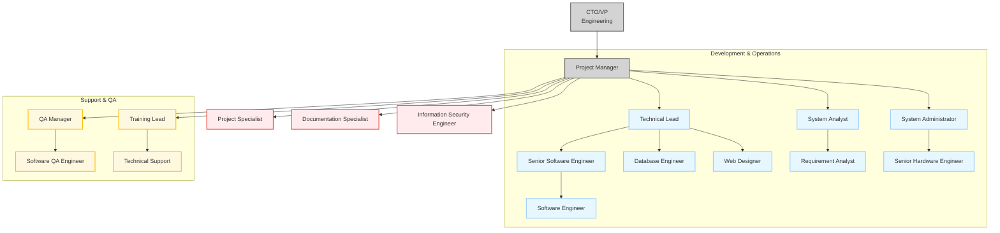

```mermaid
graph TD
    %% Direction: Top to Down
    A[CTO/VP<br>Engineering] --> B[Project Manager]

    %% Management & Specialists reporting to PM
    B --> C[Project Specialist]
    B --> S[Documentation Specialist]
    B --> T[Information Security Engineer]

    %% Core Technical Teams reporting to PM
    subgraph "Development & Operations"
        direction LR
        B --> F[Technical Lead]
        B --> D[System Analyst]
        B --> E[System Administrator]

        F --> L[Senior Software Engineer]
        L --> M[Software Engineer]
        F --> N[Database Engineer]
        F --> Q[Web Designer]

        D --> H[Requirement Analyst]
        E --> J[Senior Hardware Engineer]
    end

    subgraph "Support & QA"
        direction LR
        B --> P[QA Manager]
        P --> R[Software QA Engineer]
        B --> G[Training Lead]
        G --> O[Technical Support]
    end

    %% Class Definitions for styling
    classDef coreTeam fill:#e6f7ff,stroke:#99ccff,stroke-width:2px;
    classDef supportTeam fill:#fff8e1,stroke:#ffc107,stroke-width:2px;
    classDef management fill:#d3d3d3,stroke:#666,stroke-width:2px;
    classDef specialist fill:#ffebee,stroke:#f44336,stroke-width:2px;

    %% Assigning nodes to classes
    class A,B management
    class C,S,T specialist
    class D,E,F,H,J,L,M,N,Q coreTeam
    class G,O,P,R supportTeam
```