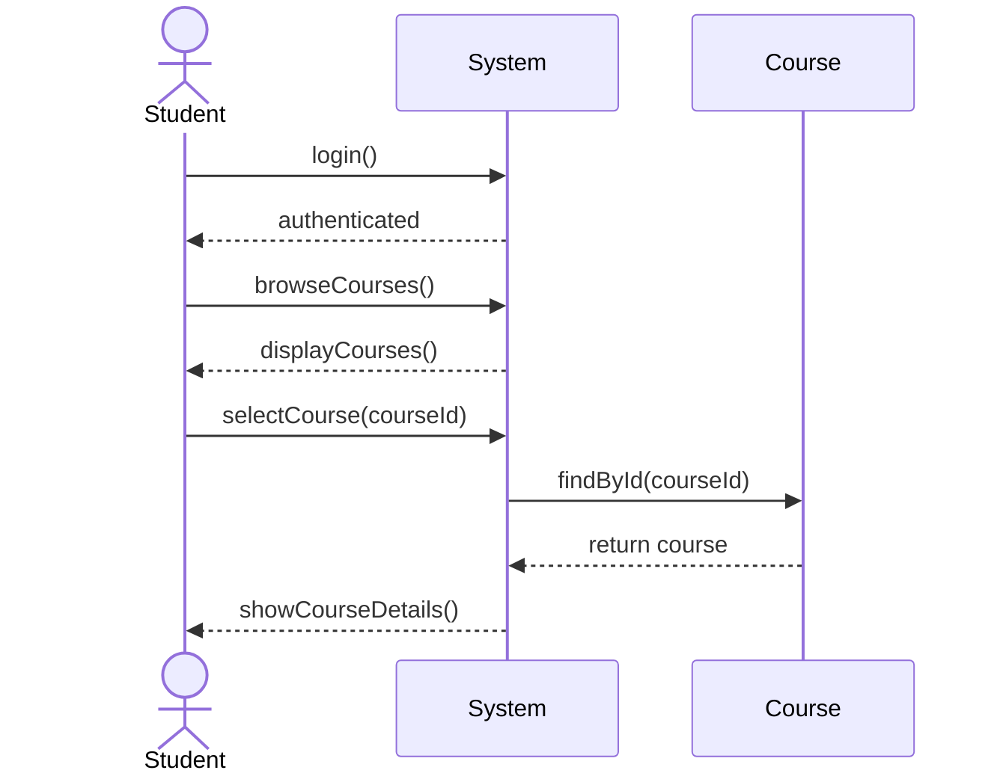
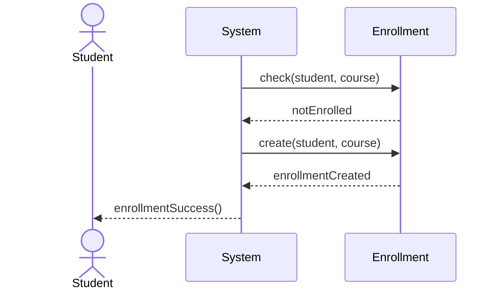
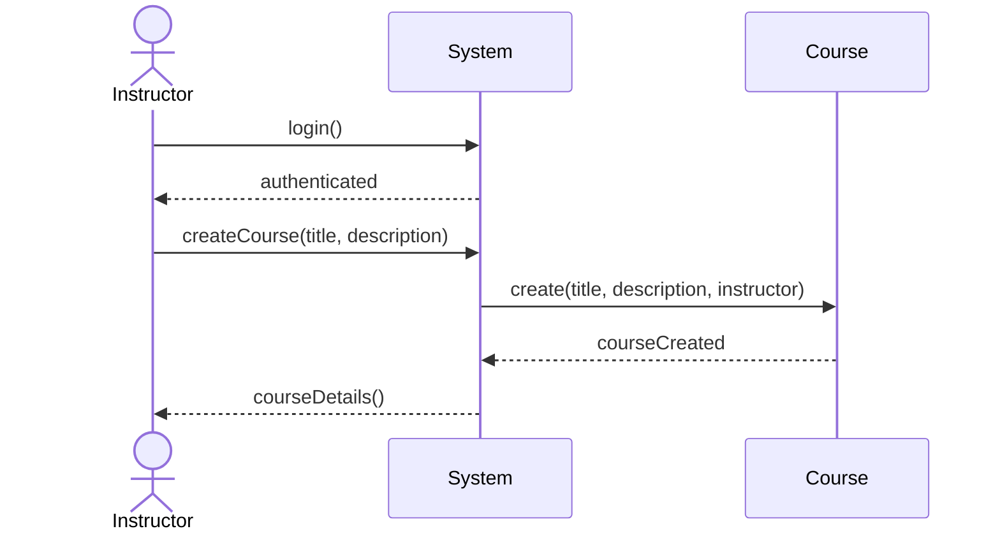
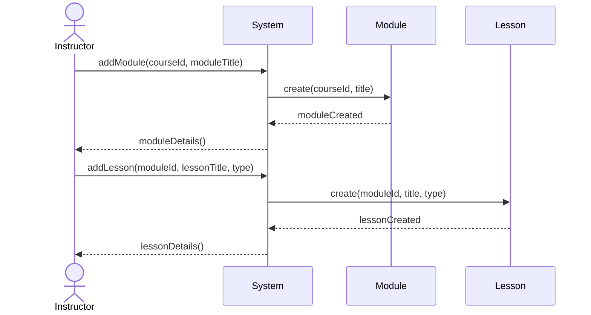
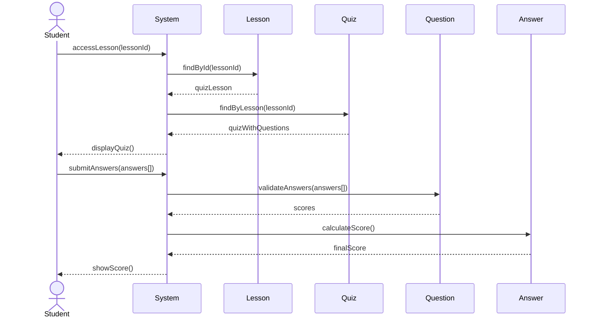
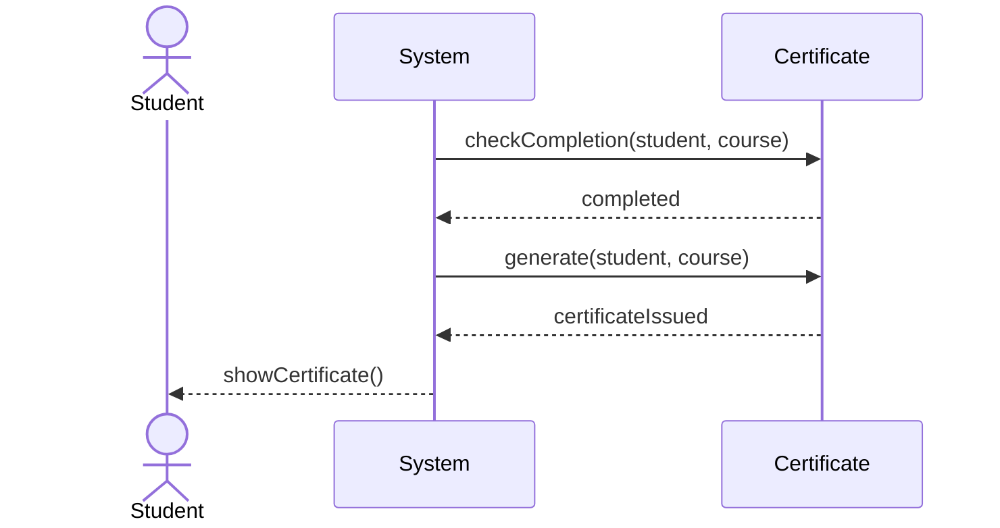

## Sequence Diagrams

### Student Enrolls in Course

#### 1. Student Authentication and Course Selection

#### 2. Enrollment Process

### Instructor Creates Course with Modules and Lessons

#### 1. Instructor Authentication and Course Creation

#### 2. Adding Modules and Lessons

### Student Takes Quiz and Gets Certificate

#### 1. Quiz Taking Process

#### 2. Certificate Generation
